# Deep Learning: Convolutional Neural Networks - Part II

```
$ echo "Data Sciences Institute"
```

---
# CNNs for computer Vision


---
# Beyond Image Classification

### CNNs
* Previous lecture: image classification

### Limitations
* Mostly on centered images
* Only a single object per image
* Not enough for many real world vision tasks

---
# Beyond Image Classification

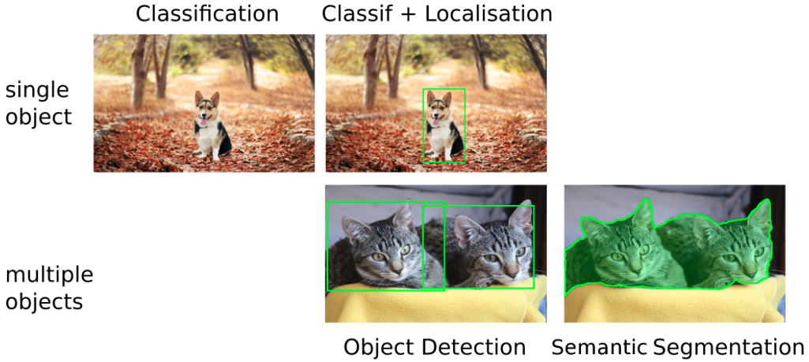

---
# Beyond Image Classification


---
# Outline

* Simple Localization as regression
* Detection Algorithms
* Fully convolutional Networks
* Semantic & Instance Segmentation

---

# Localization

---

# Localization


* Single object per image
* Predict coordinates of a bounding box `(x, y, w, h)`
* Evaluate via Intersection over Union (IoU)

---

# Localization as regression

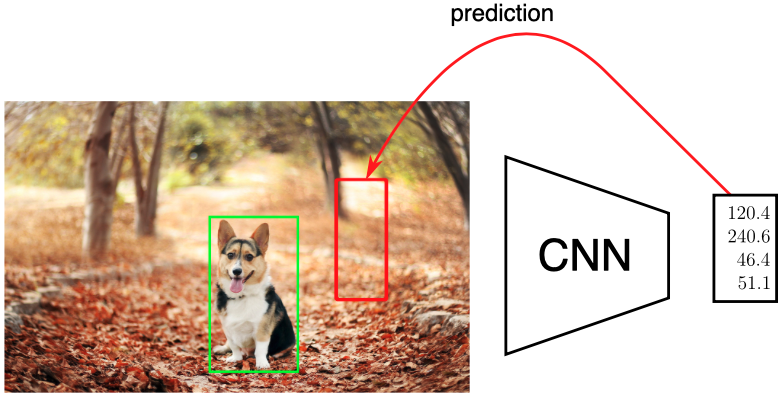


---

# Localization as regression

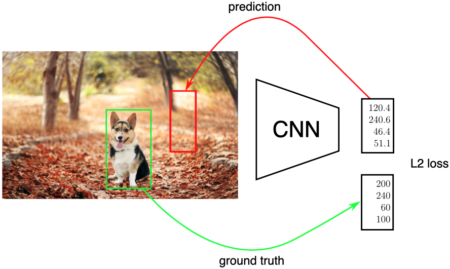


---

# Classification + Localization


* Use a pre-trained CNN on ImageNet (ex. ResNet)
* The "localization head" is trained separately with regression
* Possible end-to-end fine tuning of both tasks
* At test time, use both heads

---

# Classification + Localization


$C$ classes, $4$ output dimensions ($1$ box)
**Predict exactly $N$ objects:** predict $(N \times 4)$ coordinates and $(N \times K)$ class scores

---

# Object detection

We don't know in advance the number of objects in the image. Object detection relies on *object proposal* and *object classification*
**Object proposal:** find regions of interest (RoIs) in the image
**Object classification:** classify the object in these regions

### Two main families:

* Single-Stage: A grid in the image where each cell is a proposal (SSD, YOLO, RetinaNet)
* Two-Stage: Region proposal then classification (Faster-RCNN)


---

# YOLO


For each cell of the $S \times S$ predict:
* $B$ **boxes** and **confidence scores** $C$ ($5 \times B$ values) + **classes** $c$

Redmon, Joseph, et al. "You only look once: Unified, real-time object detection." CVPR (2016)

---

# YOLO


Final detections: $C_j * prob(c) > \text{threshold}$

Redmon, Joseph, et al. "You only look once: Unified, real-time object detection." CVPR (2016)

---

# YOLO

* After ImageNet pretraining, the whole network is trained end-to-end
* The loss is a weighted sum of different regressions

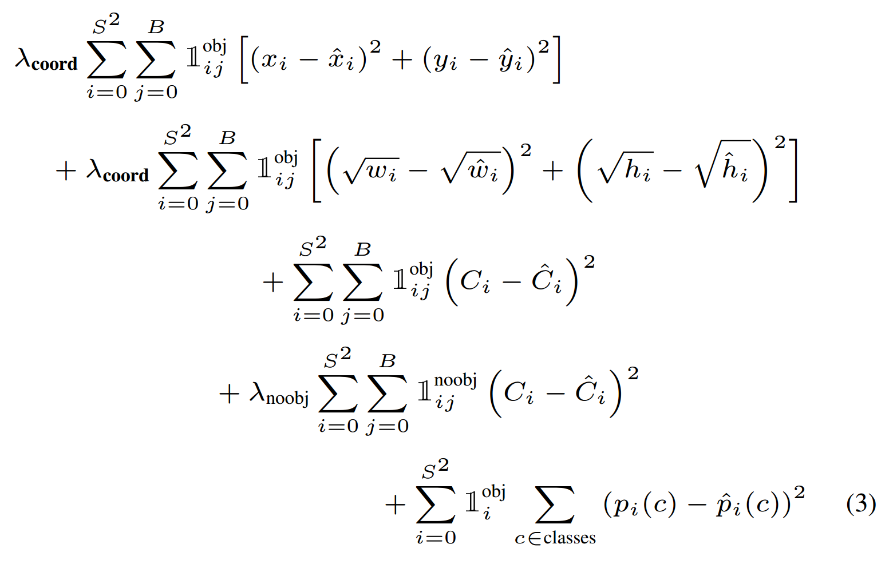

Redmon, Joseph, et al. "You only look once: Unified, real-time object detection." CVPR (2016)

---

# Box Proposals

Instead of having a predefined set of box proposals, find them on the image:
* **Selective Search** - from pixels (not learnt, no longer used)
* **Faster - RCNN** - Region Proposal Network (RPN)

**Crop-and-resize** operator (**RoI-Pooling**):
* Input: convolutional map + $N$ regions of interest
* Output: tensor of $N \times 7 \times 7 \times \text{depth}$ boxes
* Allows to propagate gradient only on interesting regions, and efficient computation

Girshick, Ross, et al. "Fast r-cnn." ICCV 2015

---

# Faster-RCNN

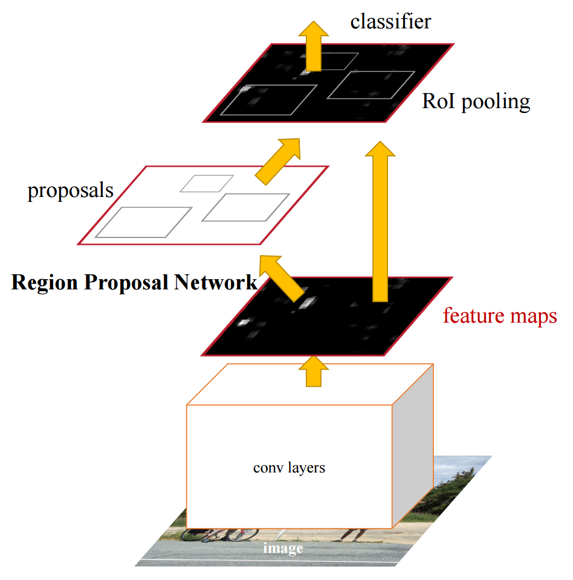

* Train jointly **RPN** and other head
* 200 box proposals, gradient propagated only in positive boxes
* Region proposal is translation invariant, compared to YOLO
<!-- * Region proposal input is a fully convolutional network: shares weights across spatial dimensions -->

Ren, Shaoqing, et al. "Faster r-cnn: Towards real-time object detection with region proposal networks." NIPS 2015


---
## Measuring performance

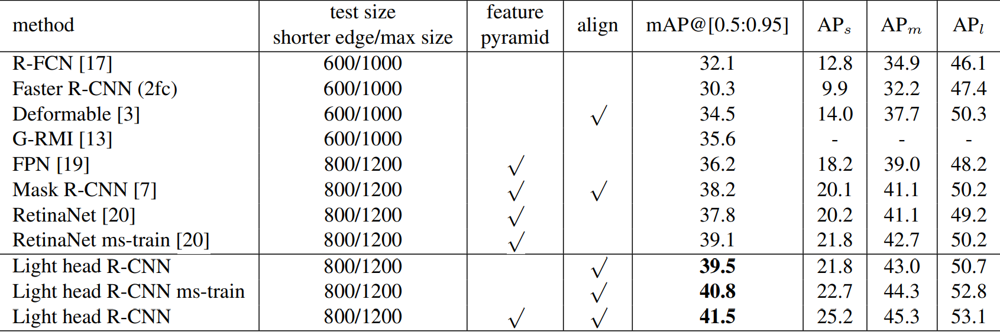


Measures: mean Average Precision **mAP** at given **IoU** thresholds

* AP @0.5 for class "cat": average precision for the class, where $IoU(box^{pred}, box^{true}) > 0.5$

Zeming Li et al. Light-Head R-CNN: In Defense of Two-Stage Object Detector 2017

---

## State-of-the-art

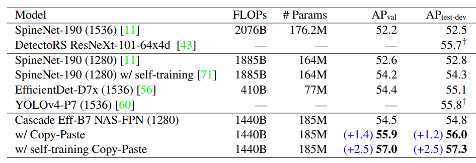

* Larger image sizes, larger and better models, better augmented data
* https://paperswithcode.com/sota/object-detection-on-coco

Ghiasi G. et al. Simple Copy-Paste is a Strong Data Augmentation Method for Instance Segmentation, 2020

---

# Segmentation

---

# Segmentation

Output a class map for each pixel (here: dog vs background)

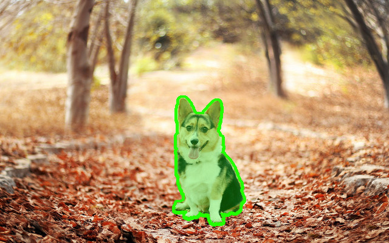

* **Instance segmentation**: specify each object instance as well (two dogs have different instances)
* This can be done through **object detection** + **segmentation**

---

# Convolutionize


* Slide the network with an input of `(224, 224)` over a larger image. Output of varying spatial size
* **Convolutionize**: change Dense `(4096, 1000)` to $1 \times 1$ Convolution, with `4096, 1000` input and output channels
* Gives a coarse **segmentation** (no extra supervision)

Long, Jonathan, et al. "Fully convolutional networks for semantic segmentation." CVPR 2015

---

# Fully Convolutional Network


* Predict / backpropagate for every output pixel
* Aggregate maps from several convolutions at different scales for more robust results

Long, Jonathan, et al. "Fully convolutional networks for semantic segmentation." CVPR 2015

---

## Mask-RCNN

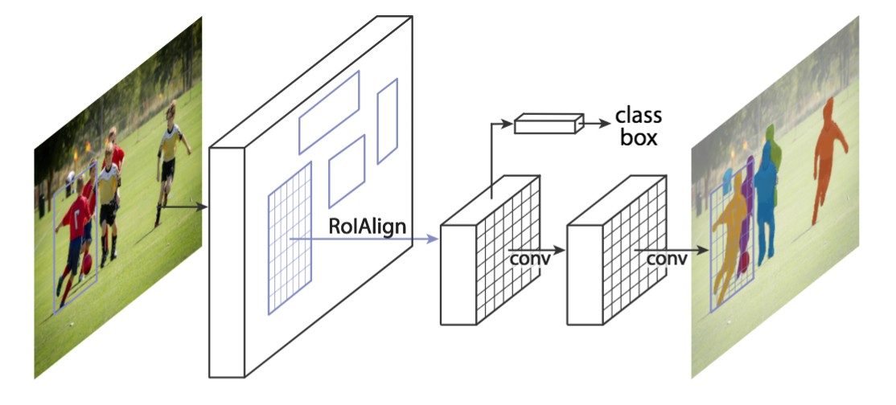

Faster-RCNN architecture with a third, binary mask head

K. He and al. Mask Region-based Convolutional Network (Mask R-CNN) NIPS 2017

---


# Results

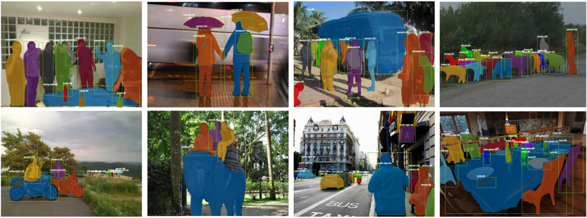

* Mask results are still coarse (low mask resolution)
* Excellent instance generalization

K. He and al. Mask Region-based Convolutional Network (Mask R-CNN) NIPS 2017

---

## Results

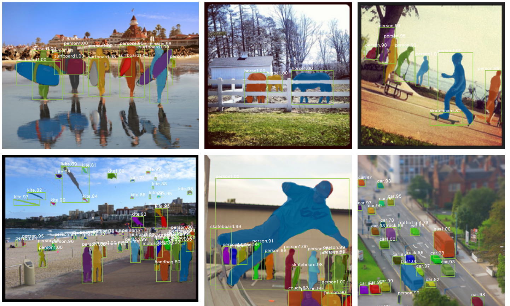

He, Kaiming, et al. "Mask r-cnn." Internal Conference on Computer Vision (ICCV), 2017.

---

## State-of-the-art & links

Most benchmarks and recent architectures are reported here:

https://paperswithcode.com/area/computer-vision


### Tensorflow

[object detection API](https://github.com/tensorflow/models/tree/master/research/object_detection)

### Pytorch

Detectron https://github.com/facebookresearch/Detectron

* Mask-RCNN, Retina Net and other architectures
* Focal loss, Feature Pyramid Networks, etc.

---

## Take away NN for Vision

### Pre-trained features as a basis

* ImageNet: centered objects, very broad image domain
* 1M+ labels and many different classes resulting in very **general** and **disentangling** representations
* Better Networks (i.e. ResNet vs VGG) have **a huge impact**


### Fine tuning

* Add new layers on top of convolutional or dense layer of CNNs
* **Fine tune** the whole architecture end-to-end
* Make use of a smaller dataset but with richer labels (bounding boxes, masks...)

---

# Next: Lab 5!
