# Deep Learning
## Lecture 1: Introduction to Deep Learning

Adapted from material by Charles Ollion & Olivier Grisel

---
# Goal of the class

## Overview

- When and where to use DL
- "How" it works
- Frontiers of DL

---

## Using DL

- Implement using `Numpy`, and `Tensorflow` (`Keras`)
- Engineering knowledge for building and training DL

---
# What is Deep Learning

* Good old Neural Networks, with more layers/modules
* Non-linear, hierarchical, abstract representations of data
* Flexible models with any input/output type and size
* Differentiable Functional Programming

---
# Why Deep Learning Now?

- Better algorithms &amp; understanding

- .grey[Computing power (GPUs, TPUs, ...)]

- .grey[Data with labels]

- .grey[Open source tools and models]

---
# Why Deep Learning Now?

- Better algorithms &amp; understanding

- Computing power (GPUs, TPUs, ...)

- .grey[Data with labels]

- .grey[Open source tools and models]

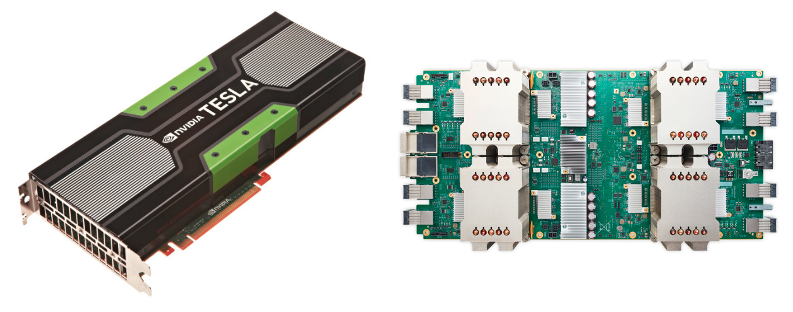
<small>_GPU and TPU_</small>

---
# Why Deep Learning Now?

- Better algorithms &amp; understanding

- Computing power (GPUs, TPUs, ...)

- Data with labels

- .grey[Open source tools and models]

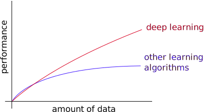
<small>_Adapted from Andrew Ng_</small>

---
# Why Deep Learning Now?

- Better algorithms &amp; understanding

- Computing power (GPUs, TPUs, ...)

- Data with labels

- Open source tools and models


---
# DL Today: Speech-to-Text

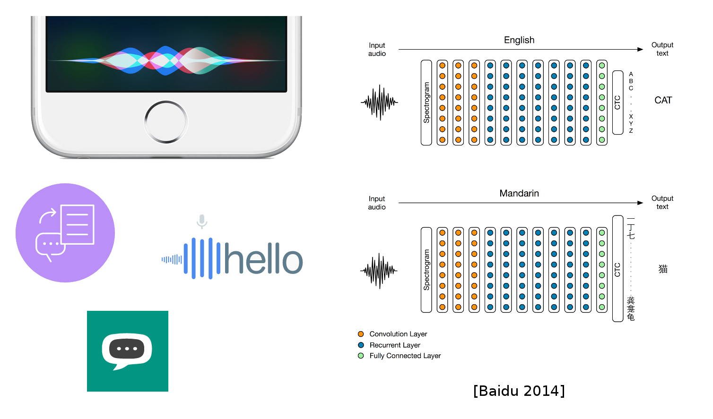DL Today: Vision

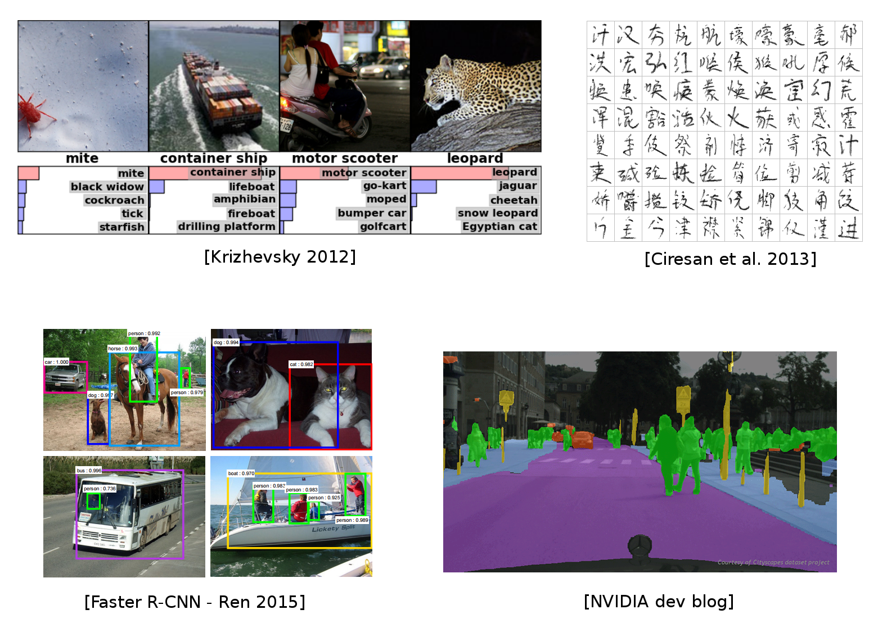DL Today: Vision

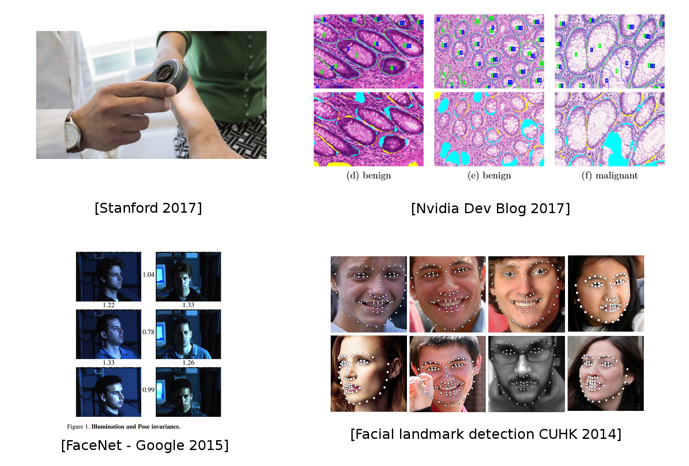DL Today: NLP

DL Today: NLP

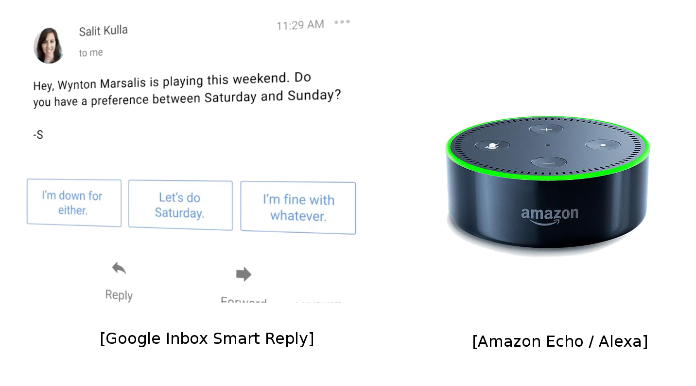ost of chatbots claiming "AI" do not use Deep Learning (yet?)

---
# DL Today: Vision + NLP

DL Today: Image translation

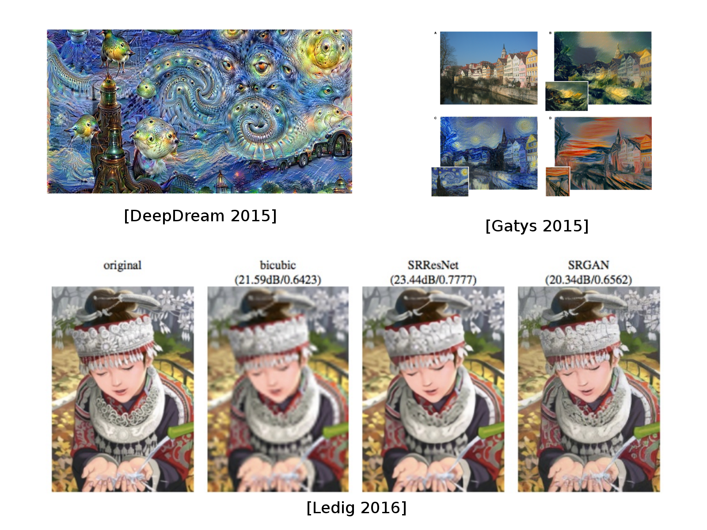DL Today: Generative models

led celebrities [Nvidia 2017]

---

kGAN v2 [Zhang 2017]


---
# DL Today: Generative models
d generation with WaveNet [DeepMind 2017]

---

<br/>

Guess which one is generated?

<audio controls><source src="./images/columbia_gen.wav"></audio> <br/>

<audio controls><source src="./images/columbia_gt.wav"></audio>

<small>_Tacotron 2 Natural TTS Synthesis by Conditioning WaveNet on Mel Spectrogram Predictions, 2017_</small>

---
# Language / Image models

Open-AI GPT-3, or DALL-E: https://openai.com/blog/dall-e/

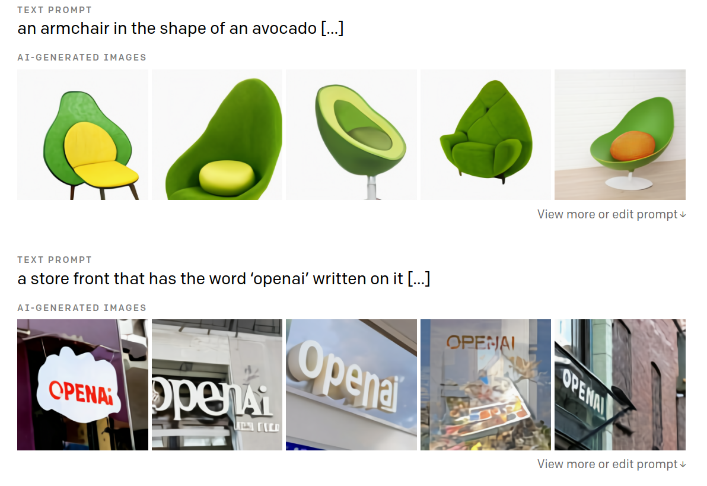L in Science: Genomics

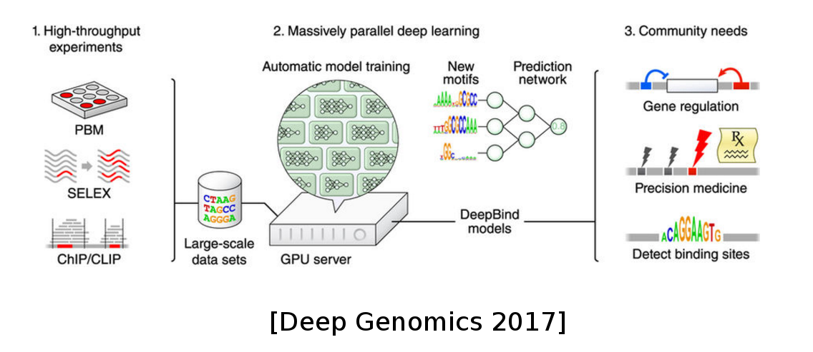

[AlphaFold by DeepMind](https://deepmind.com/blog/article/alphafold-a-solution-to-a-50-year-old-grand-challenge-in-biology)

---

# DL in Science: Chemistry, Physics

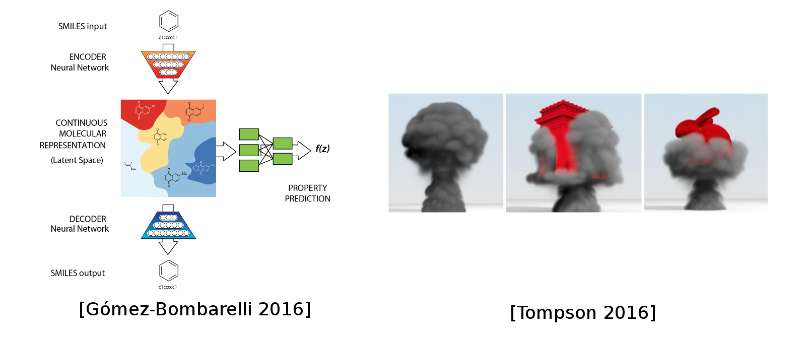DL in Science: Chemistry, Physics

te element simulator accelerated (~100 fold) by a 3D convolutional network

---
# DL for AI in games

<small> AlphaGo/Zero: Monte Carlo Tree Search, Deep Reinforcement Learning, self-play </small>

---
# Outline of the class

* Backpropagation
* Computer Vision
* Recommender Systems
* Natural Language Processing
* Optimization: theory, methods and tricks
* Generative models & unsupervised learning

---

# How this course works works

### Lectures ~1 hour

---

### Break ~15 minutes

---

### Practical session ~1 hour

- Work in breakout groups and discuss!
- Homework: complete the lab

---

### Two assignments

- One due at the end of week 1, one at the end of week 2

---

# Frameworks and Computation Graphs

---
# Libraries & Frameworks


This lecture is using **Keras**: high level frontend for **TensorFlow** (and MXnet, Theano, CNTK)

---

One lab will be dedicated to a short **Pytorch** introduction.

---
# Computation Graph

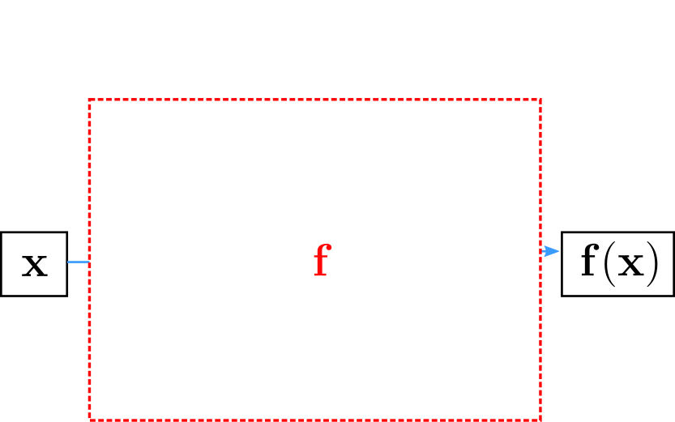

Neural network = parametrized, non-linear function

---
# Computation Graph

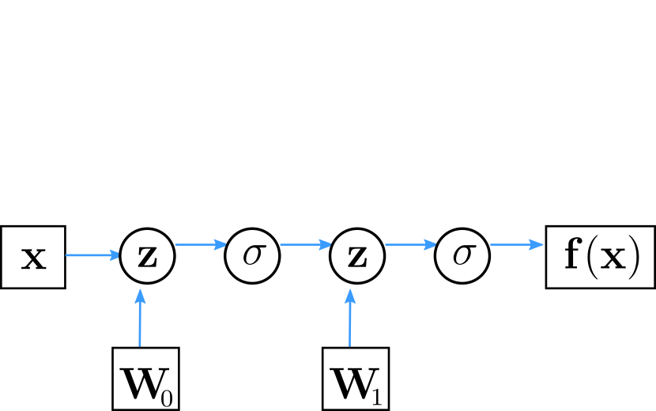

Computation graph: Directed graph of functions, depending on parameters (neuron weights)

---

# Computation Graph

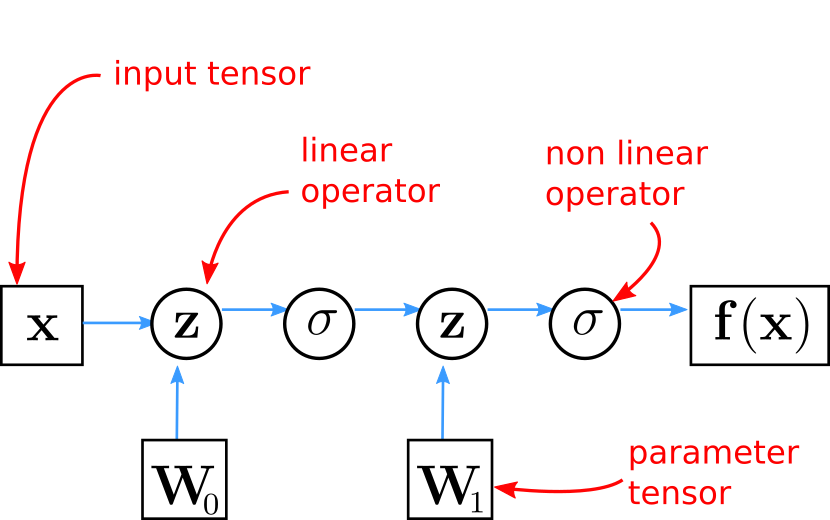

Combination of linear (parametrized) and non-linear functions

---

# Computation Graph

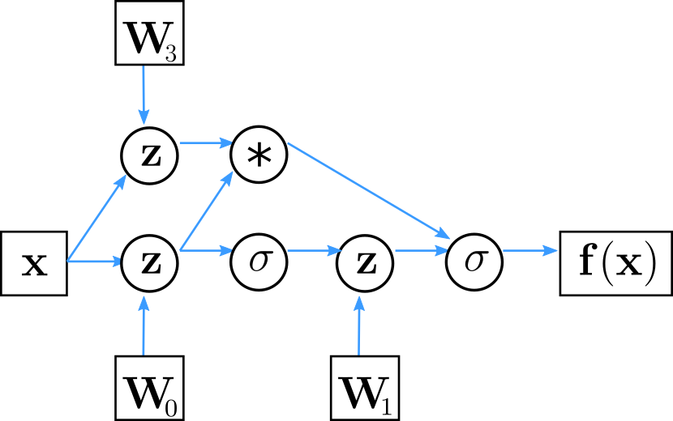

Not only sequential application of functions

---

# Computation Graph


* Automatic computation of gradients: all modules are **differentiable**!
* Theano (now Aesara), **Tensorflow 1**, etc. build a static computation graph via static declarations.
* **Tensorflow 2**, **PyTorch**, **JAX**, etc. rely on dynamic differentiable modules: "define-by-run".
* Vector computation on **CPU** and accelerators (**GPU** and **TPU**).

---

# Computation Graph


Simple keras implementation

```py
model = Sequential()
model.add(Dense(H, input_dim=N))  # defines W0
model.add(Activation("tanh"))
model.add(Dense(K))               # defines W1
model.add(Activation("softmax"))
```

---

# Next: Lab 1!
