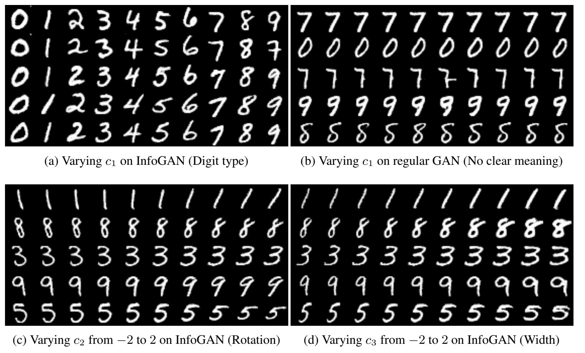
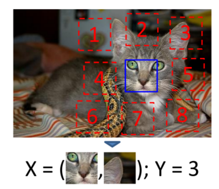
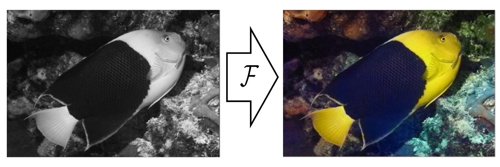
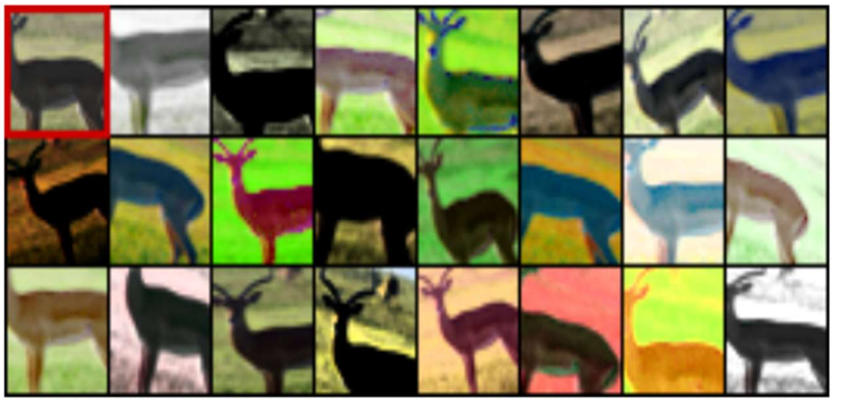
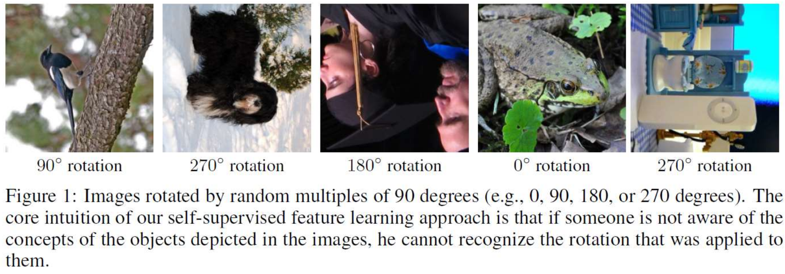
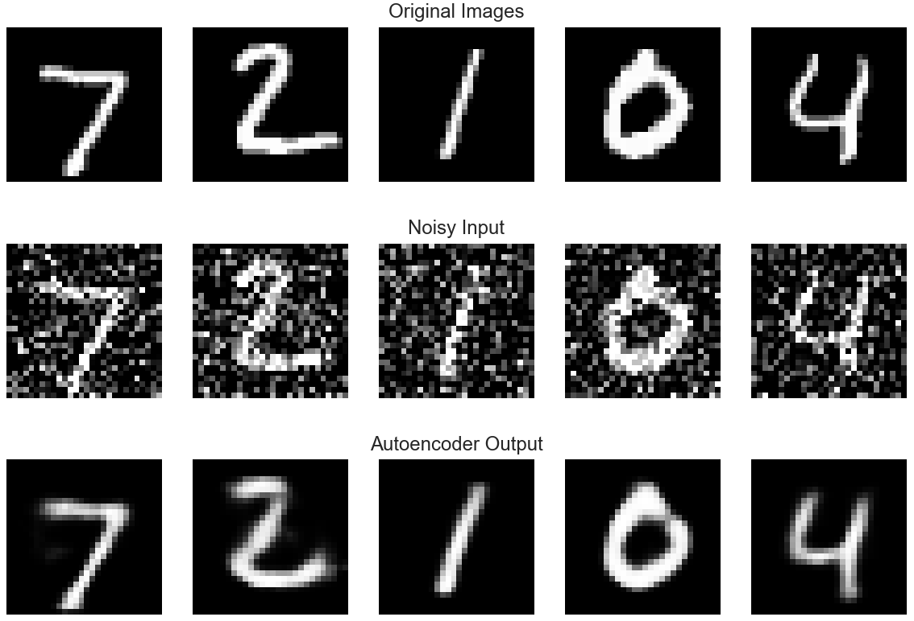
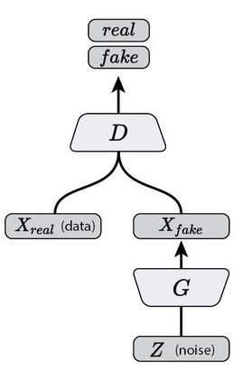
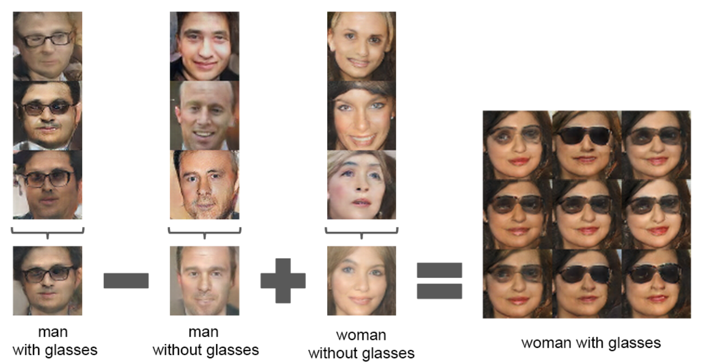
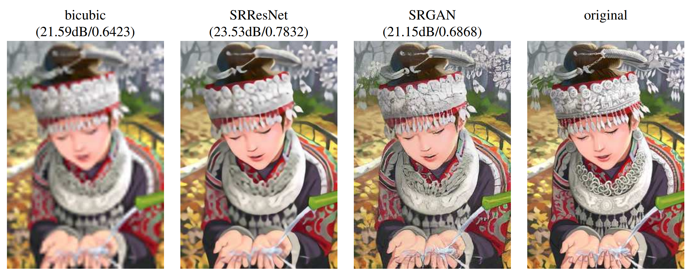

# Deep Learning: Unsupervised learning and Generative models

```
$ echo "Data Sciences Institute"
```

---

## Outline

* Unsupervised learning
* Autoencoders
* Generative Adversarial Networks

---

# Unsupervised learning

---

## Unsupervised learning

Generic goal of unsupervised learning is to **find underlying structure** in data. Specific goals include:

- clustering: group similar observations together;
- reducing the dimensionality for visualization;
- building a better representation of data for a downstream supervised task;
- learning a likelihood function, e.g. to detect anomalies;
- generating new samples similar to past observations.

<!-- 
Use case for generating new data:

- arts: smart synthetizers for electronic music.
- entertainment: procedural games: faces &amp; behaviors for NPCs, infinite landscapes....
- more natural UI, e.g. speech synthesis.
- media compression, denoising, restoration, super-resolution. 
-->

---

## Unsupervised learning

For complex data (text, image, sound, ...), there is plenty of hidden latent structure we hope to capture:
- **Image data**: find low dimensional semantic representations, independent sources of variation;
- **Text data**: find fixed size, dense semantic representation of data.

Latent space might be used to help build more efficient human labeling interfaces.

=> Goal: reduce labeling cost via active learning.

---

## Goal of unsupervised learning

A low dimension space which captures all the **variations** of data
and **disentangles** the different latent factors underlying the data.



Chen, Xi, et al. Infogan: Interpretable representation learning by information maximizing generative adversarial nets. NIPS, 2016.

---

## Self-supervised learning

find smart ways to **build supervision** without labels, exploiting domain knowledge and regularities

Use **text structure** to create supervision

- Word2Vec, BERT or GPT language models

Can we do the same for other domains?

- **Image:** exploit spatial context of an object
- **Sound, video:** exploit temporal context

No direct **accuracy** measure: usually tested through a downstream task

---

## Self-supervised learning



- Predict patches arrangement in images: 8 class classifier
- Siamese architecture for the two patches + concat

Doersch, Carl, Abhinav Gupta, and Alexei A. Efros. "Unsupervised visual representation learning by context prediction." ICCV 2015.

---

##  Self-supervised learning



- Given RGB images, generate their grayscale version
- Train a network to predict pixels color given grayscale image

Zhang et al. "Colorful Image Colorization" ECCV 2016

---

##  Self-supervised learning



- Heavy augmentation of the images
- Network must predict that augmented images are similar, and another random image dissimilar

Dosovitskiy et al. "Exemplar Networks" 2014

---

## Self-supervised learning



- Generate 4 versions of the image, rotated by 0˚, 90˚, 180˚, and 270˚
- Network must predict the angle

Spyros Gidaris, Praveer Singh, Nikos Komodakis. "Unsupervised representation learning by predicting image rotations, " ICLR 2018

---

# Autoencoders

---

## Autoencoder


Supervision : reconstruction loss of the input, usually:

$$l(x, f(x)) = || f(x) - x ||^2_2$$

**Binary crossentropy** is also used

---

## Autoencoder


* Keeping the **latent code** $\mathbf{z}$ low-dimensional forces the network to learn a "smart" compression of the data, not just an identity function
* Encoder and decoder can have arbritrary architecture (CNNs, RNNs...)

---

## Sparse/Denoising Autoencoder

Adding a sparsity constraint on activations:

$$ ||encoder(x)||_1 \sim \rho, \rho = 0.05 $$

Learns sparse features, easily interpretable

**Denoising Autoencoder**: train features for robustness to noise.



---

## Uses and limitations

After **pre-training** use the latent code $\mathbf{z}$ as input to a classifier instead of $\mathbf{x}$

**Semi-supervised learning** simultaneous learning of the latent code (on a large, unlabeled dataset) and the classifier (on a smaller, labeled dataset)

Other use: Use decoder $D(x)$ as a **Generative model**: generate samples from random noise

---

# Generative Adversarial Networks

---

## Generative Adversarial Networks



Alternate training of a **generative network** $G$ and a **discrimininative network** $D$

Goodfellow, Ian, et al. Generative adversarial nets. NIPS 2014.

---

## GANs

- D tries to find out which example are generated or real
- G tries to fool D into thinking its generated examples are real

---

## DC-GAN



- Generator generates high quality images
- Latent space has some local linar properties (vector arithmetic like with Word2Vec)

Radford, Alec, Luke Metz, and Soumith Chintala. Unsupervised representation learning with deep convolutional generative adversarial networks. 2015.

---

## Style GANs

[📼 Metfaces Interpolations Video](https://nvlabs-fi-cdn.nvidia.com/_web/stylegan3/videos/video_2_metfaces_interpolations.mp4)

[A Style-Based Generator Architecture for Generative Adversarial Networks](https://arxiv.org/abs/1812.04948) by Tero Karras, Samuli Laine, Timo Aila, 2018, and [later versions](https://nvlabs.github.io/stylegan3/)

---

## Super Resolution



"Perceptual" loss = combining pixel-wise loss mse-like loss with GAN loss

Ledig, Christian, et al. Photo-realistic single image super-resolution using a generative adversarial network. CVPR 2016.

---

## Takeaways

### (Reconstruction) Autoencoders
- have no direct probabilistic interpretation;
- are not designed to generate useful samples;
- encoder defines a useful latent representation.

---

## Takeaways

### GANs
- likelihood-free generative models;
- high quality samples from high dimensional distributions;
- discriminator not meant be used as encoder

---

## Takeaways

Adversarial training is useful beyond generative models:

- domain adaptation;
- learning representations blind to sensitive attributes;
- defend against malicious inputs (adversarial examples);
- regularization by training on adversarial examples.

Quality of samples depends a lot on the architectures
of sub-networks.

<!-- Blindness to sensitive attributes is not necessarily the best way to tackle unfair or detrimental discrination. [Quantifying fairness is a complex topic](https://geomblog.github.io/fairness/). -->

---

# Next: Lab 10!
